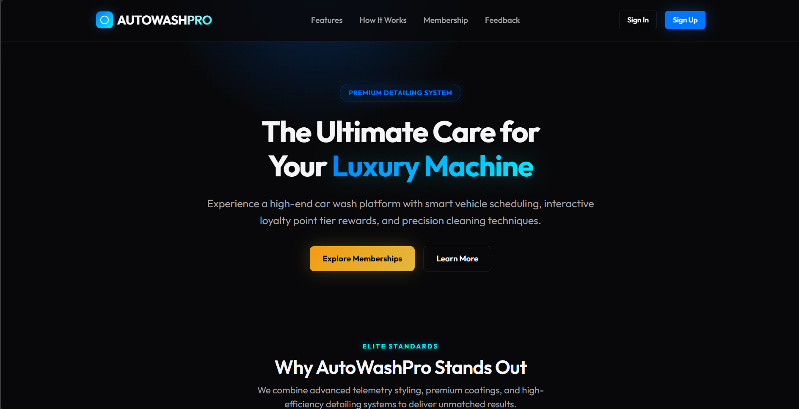
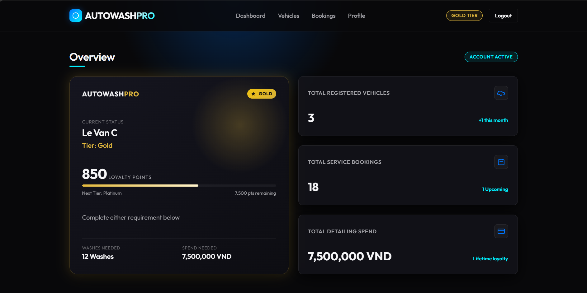

# AutoWashPro

A modern vehicle wash and membership management platform developed using Java Servlet, JSP, and MVC2 architecture.

## Screenshots

### Landing Page



### Customer Dashboard



## Overview

AutoWashPro is a web-based system designed to streamline vehicle wash booking, membership management, loyalty rewards, and customer engagement.

The platform provides:

* Customer self-service portal
* Membership tier progression
* Loyalty points system
* Vehicle management
* Booking management
* Staff administration portal

This project was developed as part of the PRJ301 course.

---

## Features

### Customer Portal

#### Landing Page

* Modern responsive interface
* Membership showcase
* Service highlights
* Customer feedback section

#### Authentication

* Customer Sign In
* Customer Sign Up
* Session-based authentication

#### Dashboard

* Membership overview
* Loyalty points tracking
* Tier progression
* Vehicle overview
* Booking overview
* Activity history

#### Membership Program

The loyalty system includes four membership tiers:

| Tier     | Benefits                             |
| -------- | ------------------------------------ |
| Member   | Default customer tier                |
| Silver   | Enhanced loyalty rewards             |
| Gold     | Increased booking privileges         |
| Platinum | Premium benefits and highest rewards |

---

### Staff Portal

#### Administration Dashboard

* Operations overview
* Customer management
* Booking management
* Loyalty management
* Reports and analytics

---

## Technology Stack

### Backend

* Java Servlet
* JSP
* JDBC
* SQL Server

### Frontend

* HTML5
* CSS3
* JavaScript
* Responsive Design
* BEM Methodology

### Architecture

* MVC2 Pattern
* DAO Pattern
* Session-based Authentication

---

## Project Structure

```text
AutoWashPro
│
├── src
│   ├── controller
│   ├── dao
│   ├── dto
│   └── dbutils
│
├── web
│   ├── customer
│   │   ├── landing-page.jsp
│   │   ├── signin.jsp
│   │   ├── signup.jsp
│   │   └── dashboard.jsp
│   │
│   ├── admin
│   │   ├── admin-login.jsp
│   │   ├── admin-dashboard.jsp
│   │   ├── customer-management.jsp
│   │   ├── booking-management.jsp
│   │   ├── loyalty-management.jsp
│   │   └── reports.jsp
│   │
│   ├── css
│   │   └── style.css
│   │
│   ├── META-INF
│   └── WEB-INF
│
└── database
```

---

## Database Modules

* Customers
* Customer Tiers
* Vehicles
* Bookings
* Loyalty Points
* Point Transactions

---

## Design Philosophy

AutoWashPro follows a premium modern design language:

* Dark Luxury Theme
* Japanese-inspired aesthetics
* Apple-like minimalism
* Responsive layouts
* Glassmorphism effects
* Consistent Design System
* Mobile-first approach

---

## MVC2 Workflow

```text
Browser
    ↓
Controller Servlet
    ↓
DAO Layer
    ↓
Database
    ↓
JSP View
```

---

## Authentication Flow

```text
Landing Page
    ↓
Sign In
    ↓
SigninController
    ↓
Session Creation
    ↓
Dashboard
```

Authenticated users are managed through HTTP Session.

---

## Future Enhancements

* Real-time booking updates
* Email notifications
* Payment integration
* Vehicle service history
* Advanced reporting dashboard
* Membership reward automation

---

## Team

Developed for academic purposes as part of the Software Engineering program at FPT University.

---

## License

This project is intended for educational and learning purposes.
